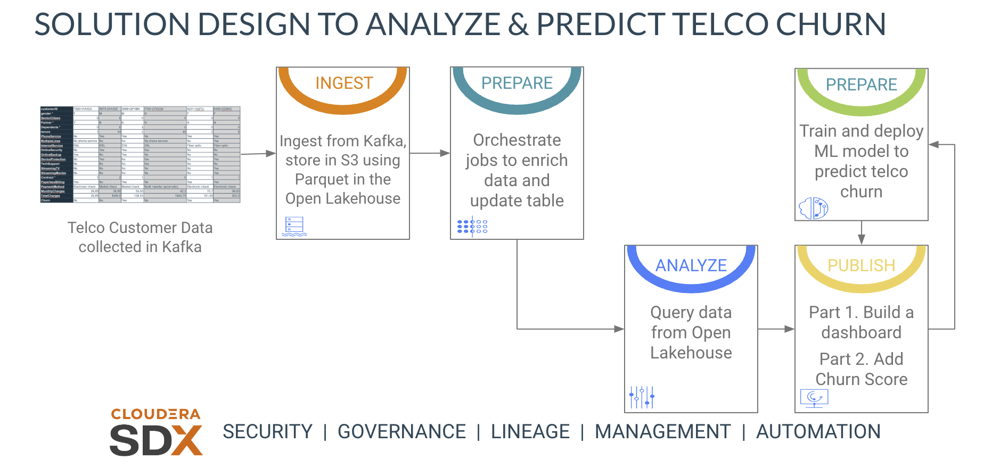

= Cloudera CDP Data Lifecycle - Workshop Student Guide

image::https://github.com/DigitalSal/cdp-ds-workshops/raw/main/images/AMERPartnerWSBanner.png[]

// :toc: left 
'''

Version : 1.0.0 `24th April 2023` +

''' 

== Introduction
The purpose of this repository is to enable the easy and quick setup of the workshop. Cloudera Data Platform (CDP) has been built from the ground up to support hybrid, multi-cloud data management in support of a Data Fabric architecture. This workshop introduces CDP, with a focus on the data management capabilities that enable the Data Fabric and Data Lakehouse.

- Data ingestion and preparation — provided by Cloudera Data Flow (CDF) and Cloudera Data Engineering (CDE).
- Global data access and persistence—​provided by Cloudera Data Warehouse (CDW).
- Data visualization with CDP Data Visualization.
- Model development and serving with Cloudera Machine Learning(CML)

== Overview
In this exercise, we will get telco data queued in a Kafka topic that contains customer information, that we'll load into our Data Lakehouse and use it to determine if a customer is likely to churn.

=== Telco Customer Churn Analytics

In this exercise we will implement an end-to-end machine learning workflow using CDP data lakehouse and CDP data services, including these high-level steps:

. Data ingest -  Use Cloudera Data Flow(CDF) to ingest data from Kafka topic to Open Data Lakehouse.
. Data enrichment -  Use Cloudera Data Engineering(CDE) to orchestrate Spark jobs to prepare the data.
. Data analysis - Use Cloudera Data Warehouse(CDW) to query and analyse data, and use Cloudera Data Visualization(DataViz) to build a dashboard.
. Model building/serving - Use Cloudera Machine Learning(CML) to build and train an ML model to predict customer churn, then deploy trained model for real-time scoring and prediction.
. Enrich data visualization -  Use deployed ML model to add real-time model scoring(Churn Score) to dashboard.

=== Visual Guide to Data Lifecycle Workshop

== Pre-requisites
- Laptop with a supported OS (Windows 7 not supported) or MacBook.
- A modern browser - Google Chrome (IE, Firefox, Safari not supported).
- Wi-Fi Internet connection.
- Git installed (optional).

== Lab Guides

=== Lab 1: CDF Lab:

https://github.com/DigitalSal/cdp-data-lifecycle/blob/main/lab_guides_pdf/english/CDP-PC-CDF.pdf[CDP-PC-CDF.pdf]

=== Lab 2: CDE Lab:

https://github.com/DigitalSal/cdp-data-lifecycle/blob/main/lab_guides_pdf/english/CDP-PC-CDE.pdf[CDP-PC-CDE.pdf]

=== Lab 3: CDW & DataViz Lab:

https://github.com/DigitalSal/cdp-data-lifecycle/blob/main/lab_guides_pdf/english/CDP-PC-CDW.pdf[CDP-PC-CDW.pdf]

=== Lab 4: CML Lab:

https://github.com/DigitalSal/cdp-data-lifecycle/blob/main/lab_guides_pdf/english/CDP-PC-CML.pdf[CDP-PC-CML.pdf]

== CML Project - Github Repo URL
This github repo will be used to build and deploy the telco churn ML model: 
https://github.com/campossalex/TelcoChurn[]

== Configurations:

=== ChurnScore Expression:

[source,python]
----
cviz_rest('{"url":"https://modelservice.ml-2bcb0d2f-17f.latam-to.yu1t-vbzg.cloudera.site/model","accessKey":"m4fjixn3hw3wicc0w02akq02m8ubxjrf","colnames":["monthlycharges","totalcharges","tenure","gender","dependents","onlinesecurity","multiplelines","internetservice","seniorcitizen","techsupport", "contract","streamingmovies", "deviceprotection", "paymentmethod","streamingtv","phoneservice", "paperlessbilling","partner", "onlinebackup"],"response_colname":"result"}')
----

=== Bonus - Iceberg Time Travel:

List table snapshosts:

====
[source,sql]
----
DESCRIBE HISTORY <user_id>.telco_data_curated;
----

[source,sql]
----
SELECT * FROM user001.telco_data_curated FOR SYSTEM_VERSION AS OF snapshotid;
----
====
